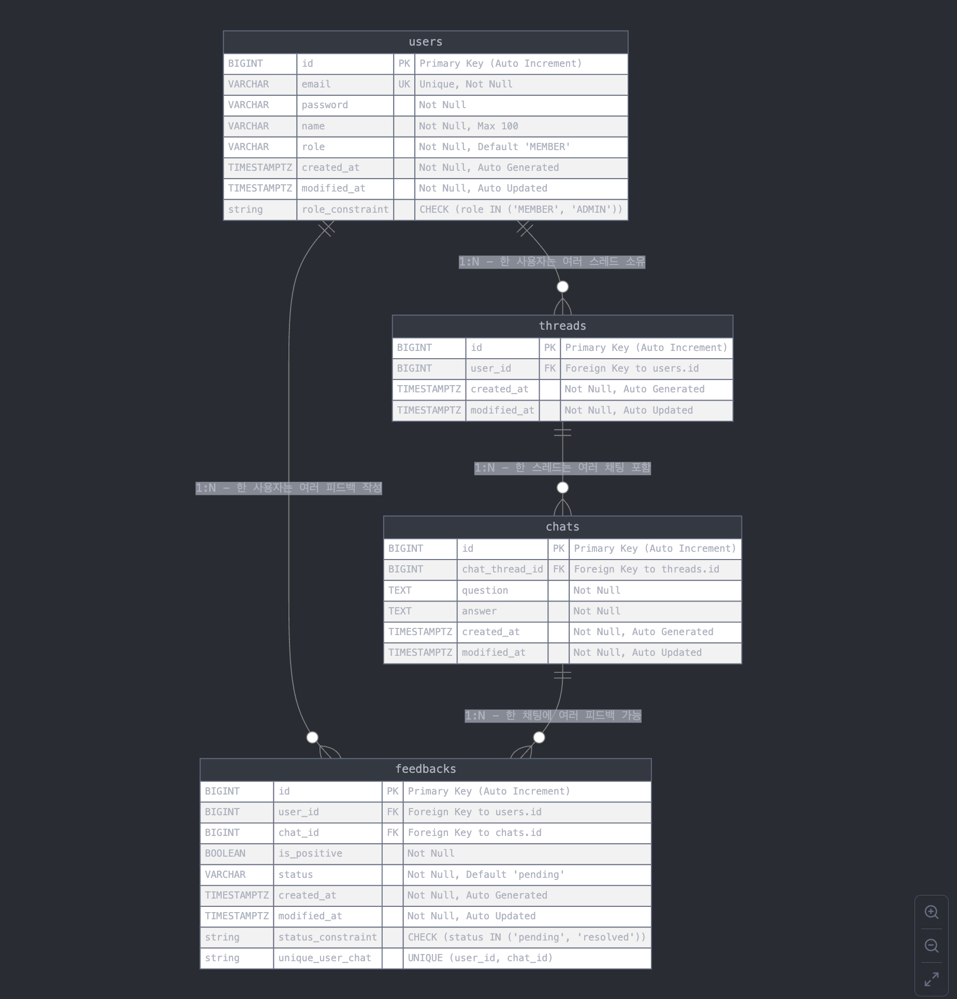
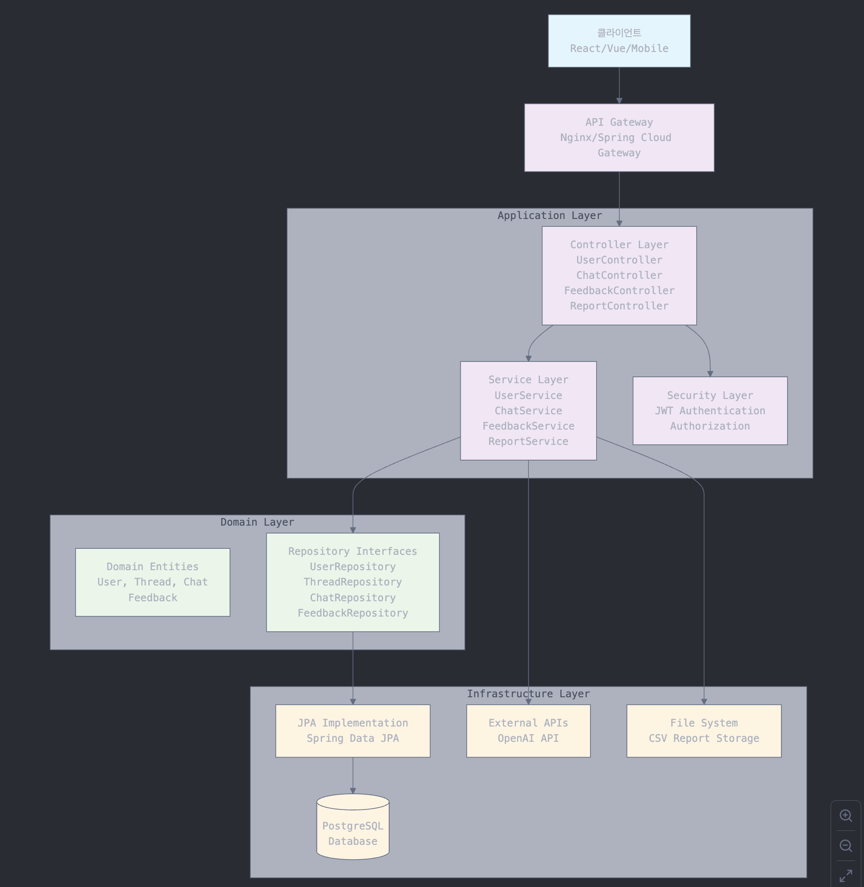

## 과제 분석
### 요구사항 분석
#### 도메인 식별
- **User**
  - 기능 : 회원가입, 로그인, 권한 관리
  - 엔티티 : User
  
- **Chat**
  - 기능 : 대화 생성, 목록 조회, 스레드 관리
  - 엔티티 : Chat, Thread

- **Feedback**
  - 기능 : 피드백 생성, 목록 조회, 상태 변경
  - 엔티티 : Feedback

- **Analytics**
  - 기능 : 사용자 활동 기록 요청, 보고서 생성 요청
  - 엔티티 : Report

### 데이터베이스 설계
#### ERD

#### 테이블 정의 
1. users 테이블
역할: 사용자 정보 및 권한 관리
주요 컬럼: id, email, password, name, role, created_at

2. threads 테이블
역할: 사용자별 대화 세션 관리
주요 컬럼: id, user_id, created_at, last_activity
특징: 30분 규칙을 위한 last_activity 컬럼

3. chats 테이블
역할: 스레드 내 개별 질문-답변 저장
주요 컬럼: id, thread_id, question, answer, created_at

4. feedbacks 테이블
역할: 사용자 피드백 관리
주요 컬럼: id, user_id, chat_id, is_positive, status, created_at

#### 테이블 관계
- User ↔ Thread: 1:N 관계
- Thread ↔ Chat: 1:N 관계
- chats.thread_id → threads.id
- User ↔ Feedback: 1:N 관계
- feedbacks.user_id → users.id
- Chat ↔ Feedback: 1:N 관계
- feedbacks.chat_id → chats.id
- 관계 구조
  User (1) ──────── (N) Thread (1) ──────── (N) Chat 
  │                                          │ 
  │                                          │ 
  └─────────── (N) Feedback (N) ─────────────┘ 

### 시스템아키텍처 설계

### API 설계
API 설계
1. 사용자 관리 API
   POST   /api/auth/signup     - 회원가입
   POST   /api/auth/login      - 로그인
2. 대화 관리 API
   POST   /api/chats           - 대화 생성
   GET    /api/chats           - 대화 목록 조회 (페이지네이션, 정렬)
   DELETE /api/threads/{id}    - 스레드 삭제
3. 피드백 관리 API
   POST   /api/feedbacks       - 피드백 생성
   GET    /api/feedbacks       - 피드백 목록 조회 (페이지네이션, 필터링)
   PUT    /api/feedbacks/{id}/status - 피드백 상태 변경 (관리자만)
4. 분석 및 보고 API
   GET    /api/analytics/activity    - 사용자 활동 기록 요청 (관리자만)
   GET    /api/reports/daily         - 보고서 생성 요청 (관리자만)

### 코드작성
#### 로그인 기능 구현
#### 챗봇 기능 구현

## AI 활용방안
###  
### 활용 2. README 작성, 아키텍쳐 출력
## 어려웠던 점
### 로그인 기능 구현 시 JWT 토큰 발급 및 검증 과정에서 CORS 설정과 토큰 유효성 검사 로직이 복잡하게 얽혀 어려움을 겪었습니다. 또한, OpenAI API와의 통신에서 응답 형식이 예상과 달라 디버깅에 시간이 소요
    2. 과제의 진행함에 있어 AI 를 어떻게 활용 하셨나요? 어떤 어려움이 있었나요?
    3. 지원자가 구현하기 가장 어려웠던 1개 이상의 기능을 설명 해주세요.
    4. 공개되지 않은 기준이 있지만 구현의 양은 배점이 낮습니다.